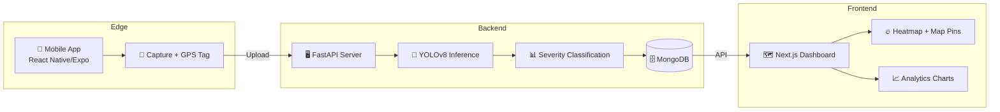

# 🚦 RoadWatch AI

**AI-Powered Pothole Detection & Civic Reporting Platform**

RoadWatch AI uses computer vision to detect potholes and road damage from video/image feeds, geotags each detection, and pushes structured records to a live dashboard — shifting road maintenance from reactive to proactive.

---

## 🏗️ Architecture



## 📂 Project Structure

```
├── backend/           # Python FastAPI + YOLOv8 inference server
│   ├── main.py        # API endpoints
│   ├── config.py      # Environment configuration
│   ├── models/        # Pydantic schemas
│   ├── services/      # YOLO inference + MongoDB service
│   ├── scripts/       # Training + seed data scripts
│   └── Dockerfile     # Container deployment
│
├── dashboard/         # Next.js web dashboard
│   └── src/
│       ├── app/       # Pages (dashboard + analytics)
│       ├── components/  # Map, filters, cards, stats
│       └── lib/       # API client
│
├── mobile-app/        # React Native (Expo) capture app
│   ├── screens/       # Capture, History, Settings
│   └── services/      # API + Location services
│
└── docs/              # API contracts, setup guide, model docs
```

## 🚀 Quick Start

### 1. Backend

```bash
cd backend
python -m venv venv && venv\Scripts\activate
pip install -r requirements.txt
copy .env.example .env
# Edit .env with your MongoDB URI
python scripts/seed_data.py   # Seed demo data
python main.py                # Start server → localhost:8000
```

### 2. Dashboard

```bash
cd dashboard
npm install --legacy-peer-deps
npm run dev                   # Start → localhost:3000
```

### 3. Mobile App

```bash
cd mobile-app
npm install
npx expo start                # Scan QR with Expo Go
```

## 🎯 Features

| Feature | Description |
|---------|-------------|
| **YOLOv8 Detection** | Real-time pothole detection from images/video |
| **Severity Classification** | Minor / Moderate / Severe based on damage size |
| **GPS Geotagging** | Every detection tagged with precise coordinates |
| **Interactive Map** | Leaflet map with heatmap + color-coded pins |
| **Analytics Dashboard** | Severity trends, status breakdown, confidence metrics |
| **Mobile Capture** | Continuous capture mode with GPS + auto-upload |
| **Geospatial Queries** | Find potholes within a radius (MongoDB 2dsphere) |
| **Status Workflow** | Track: Reported → In Progress → Fixed |

## 🛠️ Tech Stack

| Layer | Technology |
|-------|-----------|
| Backend | Python, FastAPI, Ultralytics YOLOv8, OpenCV |
| Database | MongoDB (motor async driver) |
| Dashboard | Next.js 14, React-Leaflet, Recharts |
| Mobile | React Native, Expo, expo-camera, expo-location |
| Deployment | Docker |

## 📖 Documentation

- [API Reference](docs/API.md)
- [Setup Guide](docs/SETUP.md)
- [Model Documentation](docs/MODEL.md)

## 📋 Future Roadmap

- [ ] Accelerometer-based jolt detection for cross-validation
- [ ] Government tender/contractor database cross-referencing
- [ ] Municipal vehicle fleet integration (passive scanning)
- [ ] Automated ward-wise alert routing
- [ ] Edge deployment (TensorRT on NVIDIA Jetson)
- [ ] Multi-frame video tracking to reduce false positives

---

Built with ❤️ for smarter cities.
